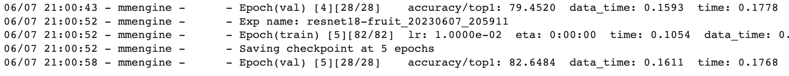
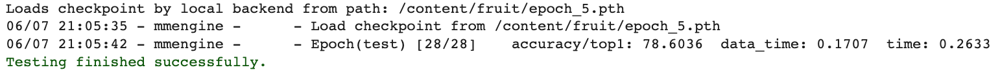
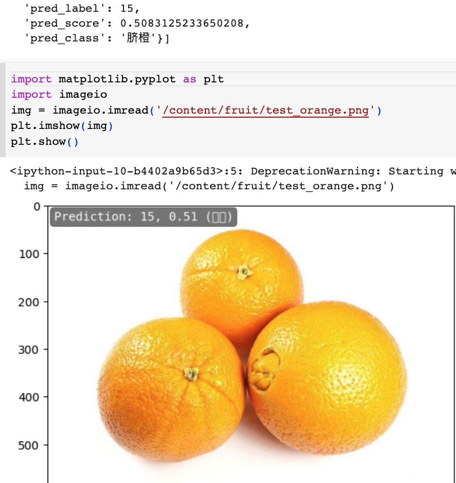

# Assignment 2
Fruit classification using the MMPretrain tools. ResNet18 with fine-tune on a 30-class fruit dataset.

Validation set performance:

Test set performance:

An example of my own orange image:

I had a hard time trying to make the Chinese characters show correctly in Colab. 
