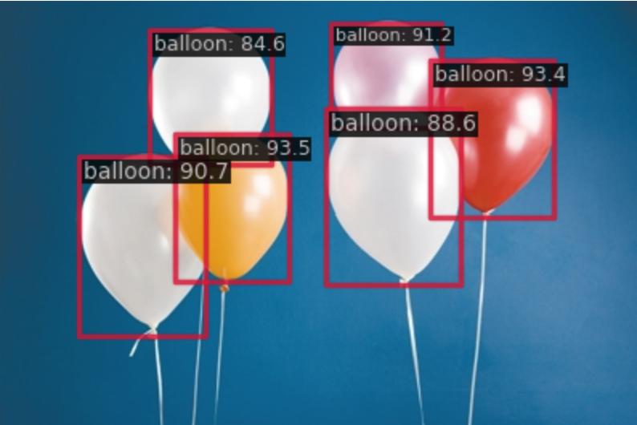
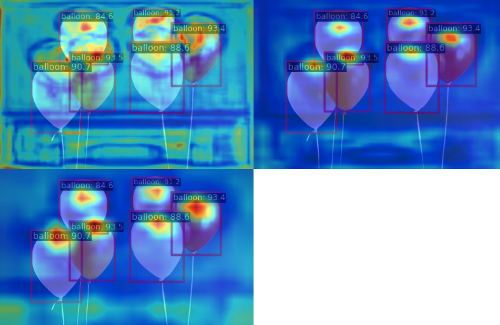

# Use MMDetection to detect Balloons

This is purely a reproduction of https://github.com/CrabBoss-lab/openmmlab-Camp/tree/master/03-mmdetection-task

Main deliverables:
- Config file: `balloon_rtmdet.py`
- Notebook: `MMDet.ipynb`. It has all visualizations, training/testing logs, etc.

## Test set perfomance
```
Average Precision  (AP) @[ IoU=0.50:0.95 | area=   all | maxDets=100 ] = 0.768
 Average Precision  (AP) @[ IoU=0.50      | area=   all | maxDets=100 ] = 0.862
 Average Precision  (AP) @[ IoU=0.75      | area=   all | maxDets=100 ] = 0.835
 Average Precision  (AP) @[ IoU=0.50:0.95 | area= small | maxDets=100 ] = 0.000
 Average Precision  (AP) @[ IoU=0.50:0.95 | area=medium | maxDets=100 ] = 0.372
 Average Precision  (AP) @[ IoU=0.50:0.95 | area= large | maxDets=100 ] = 0.917
 Average Recall     (AR) @[ IoU=0.50:0.95 | area=   all | maxDets=  1 ] = 0.254
 Average Recall     (AR) @[ IoU=0.50:0.95 | area=   all | maxDets= 10 ] = 0.814
 Average Recall     (AR) @[ IoU=0.50:0.95 | area=   all | maxDets=100 ] = 0.832
 Average Recall     (AR) @[ IoU=0.50:0.95 | area= small | maxDets=100 ] = 0.000
 Average Recall     (AR) @[ IoU=0.50:0.95 | area=medium | maxDets=100 ] = 0.642
 Average Recall     (AR) @[ IoU=0.50:0.95 | area= large | maxDets=100 ] = 0.942
06/18 12:05:00 - mmengine - INFO - bbox_mAP_copypaste: 0.768 0.862 0.835 0.000 0.372 0.917
06/18 12:05:00 - mmengine - INFO - Epoch(test) [13/13]    coco/bbox_mAP: 0.7680  coco/bbox_mAP_50: 0.8620  coco/bbox_mAP_75: 0.8350  coco/bbox_mAP_s: 0.0000  coco/bbox_mAP_m: 0.3720  coco/bbox_mAP_l: 0.9170  data_time: 0.0257  time: 0.0659
```

## Single image prediction example



## Feature map

Feature map of the neck output:


