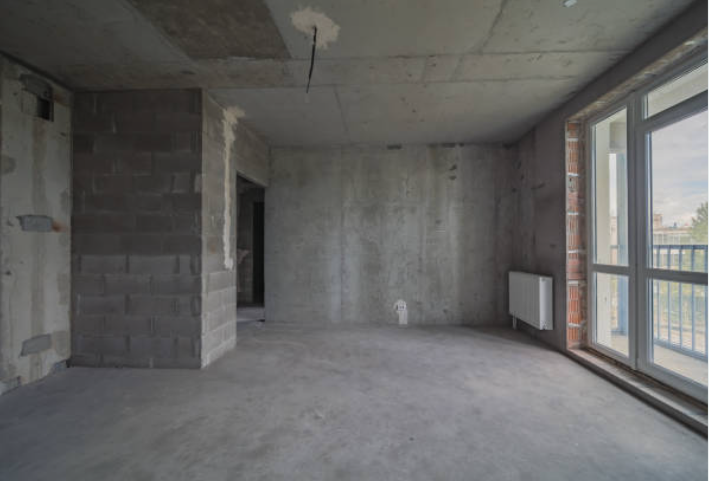
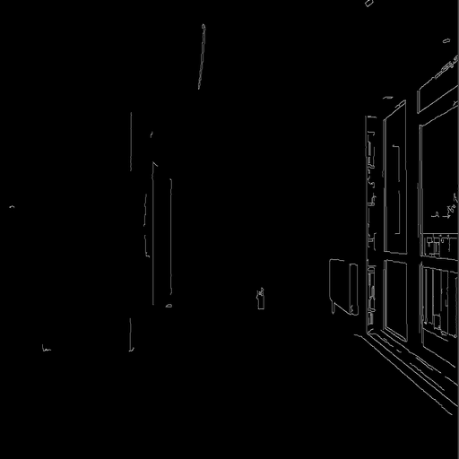
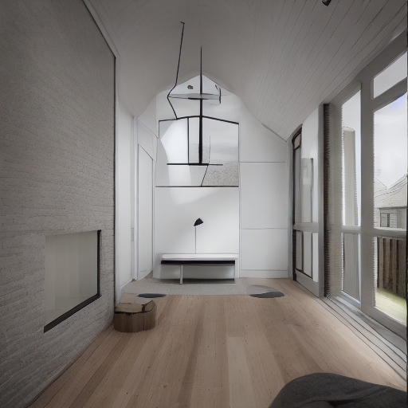

# MMagic use case: generate unfinished interior 
Use MMagic and ControlNet to generate interior design idea.

Input:

Edge detection by `cv2.Canny`:

Design generation by ControlNet:

Details of execution can be seen in the notebooks.